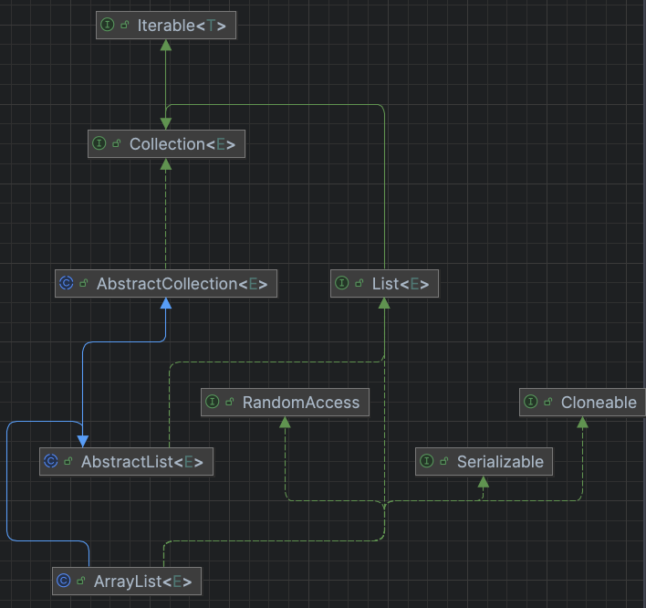
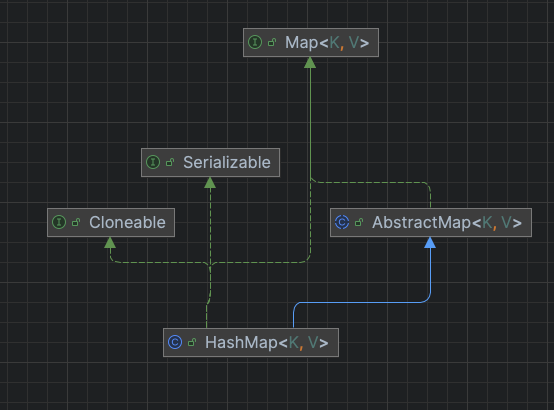
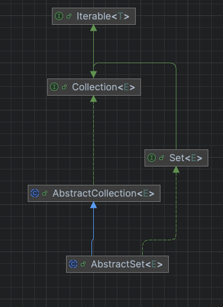

# List & ArrayList

## 结构图


## 总结内容
- ArrasyList本质上是一个Object[] elementData，里面有一个int size属性
- 初始化方式 
  - new ArrayList()
  - new ArrayList(10)
  - new ArrayList(Collection<? extends E> c)
- indexOf:获得当前元素的索引位置
- get：获得当前索引的元素
- set:根据索引设置当前位置的值

## 扩容和不扩容的例子

```java
ArrayList<String> list = new ArrayList<>(2); // elementData.length = 2
list.add("first");   // size = 1
list.add("second");  // size = 2
list.add("third");   // minCapacity = 3, 3 - 2 > 0，触发扩容
```
## 注意事项

- Collection<? extends E>：表示一个集合，其中包含的元素类型是 E 或 E 的某个子类型。
- 当使用add方法时，
  - 进行扩容，扩充为以前的1.5倍
    - int newCapacity = oldCapacity + (oldCapacity >> 1);
  - 不进行扩容：当前list的容量大于所需容量时
    - 比如，List的长度为10,目前有5个元素，我又增加一个元素，不需要扩容


# Map & HashMap

## 结构图



## 总结内容 
- 初始容量：默认16
- 负载因子：默认0.75
- 存储结构：数组+链表/红黑树
- Entry接口是在Map接口中定义的，具体的实现有Node<K, V>和TreeNode<K, V>，分别用于链表和红黑树的存储。
- 


```java
// HashMap的存储结构示意图
table[0] -> Node -> Node -> Node (链表)
table[1] -> null
table[2] -> TreeNode -> TreeNode -> TreeNode (红黑树)
table[3] -> Node -> Node
```

## 三种视图
- entrySet
- keySet
- values

keySet继承AbstractSet


## 疑问
- 关于哈希冲突

## 注意事项

# Stream使用

# Arrays使用